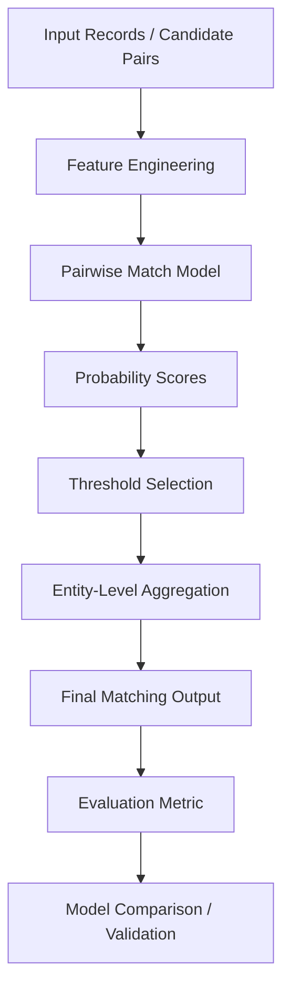

# Business Entity Resolution Project

This project implements a practical baseline for business entity resolution using pairwise feature engineering, machine learning, threshold optimization, and an evaluation metric designed for entity matching tasks.

The goal is to determine whether records from two data sources refer to the same business entity, then aggregate those pairwise predictions into final entity-level clusters.

---

## 1. Project Overview

The repository follows a common entity resolution pipeline:

1. Prepare candidate record pairs.
2. Generate similarity and equality-based features.
3. Train a binary classifier to estimate match probability.
4. Choose a threshold for deciding whether two entities match.
5. Aggregate pair predictions into entity-level matches.
6. Evaluate using an F0.5-based metric optimized for precision-heavy clustering.

This is a baseline system intended for experimentation and extension. It is designed to be simple, explainable, and easy to modify for more advanced matching logic.

---

## 2. High-Level Architecture



---

## 3. Repository Structure

```text
student_resource/
├── README.md
├── pytest.ini
├── evaluate.py
├── threshold.py
├── business_entity_resolution/
│   ├── __init__.py
│   └── src/
│       ├── __init__.py
│       ├── features.py
│       ├── model.py
│       └── threshold.py
├── code/
│   └── business_entity_resolution/
│       ├── __init__.py
│       └── src/
│           ├── __init__.py
│           ├── features.py
│           ├── model.py
│           └── threshold.py
├── dataset/
│   ├── train/
│   └── test/
├── output/
├── scripts/
├── tests/
│   ├── conftest.py
│   ├── test_baseline_model.py
│   ├── test_evaluate_metric.py
│   └── test_threshold.py
├── utils/
├── __pycache__/
├── .pytest_cache/
├── .venv/
└── .git/
```

---

## 4. File-by-File Explanation

### Root-level files

#### `README.md`
This file documents the project structure, its purpose, and how the components work together.

#### `pytest.ini`
Pytest configuration for the project. It sets the Python import path and points pytest to the `tests` folder.

#### `evaluate.py`
This is the main evaluation module for the challenge metric.

It includes:
- `_as_record_set()` for converting record collections into sets
- `f05_score()` for scoring a single true-vs-predicted entity cluster
- `_coerce_group_mapping()` for converting mappings or DataFrames into group structures
- `evaluate()` which computes the macro-average F0.5 score across entities
- `macro_f05_s1()`, `score()`, and `compute_metric()` as compatibility wrappers

This is the metric layer for entity resolution performance.

#### `threshold.py`
This file provides threshold optimization and decision logic for model outputs.

It contains:
- `_f05_score()` for precision/recall balancing
- `choose_threshold()` to select a match threshold using probabilities and labels
- `keep_match()` to decide whether a score should pass a threshold
- `aggregate_entity_matches()` to merge pairwise scores into entity-level matches
- `entity_decision()` and `decide_entity_match()` for entity-level logic

This module is used to translate probability scores into final accept/reject matches.

---

### `business_entity_resolution/`

This is the main package used for the project logic.

#### `business_entity_resolution/__init__.py`
Installs the public package API and exposes the main helper functions.

#### `business_entity_resolution/src/features.py`
This is the feature-engineering layer.

It builds pairwise features for candidate matches by comparing record attributes such as:
- text similarity
- token overlap
- character n-gram matching
- numeric differences
- exact field matches

The module also includes logic to normalize column names and detect left/right attribute pairs like:
- `left_name` / `right_name`
- `source_city` / `target_city`
- `entity1_address` / `entity2_address`

This file is the foundation of the matching model because it converts raw pair records into signals the classifier can learn from.

#### `business_entity_resolution/src/model.py`
This is the modeling layer.

It contains:
- `_mutate_name()` and `_mutate_address()` for generating hard-negative examples
- `generate_hard_negatives()` to create near-miss negative pairs
- `train_catboost_model()` and `train_lightgbm_model()` to fit baseline classifiers
- `compare_validation_results()` to benchmark CatBoost vs LightGBM
- `train_baseline_models()` to train and evaluate baseline models

This file is responsible for the baseline ML pipeline and model comparisons.

#### `business_entity_resolution/src/threshold.py`
This mirrors the threshold utilities in the root-level module and is part of the package interface.

It is used for:
- choosing a probability cutoff
- deciding whether a pair is a match
- aggregating candidate predictions into record-entity matches

---

### `code/`

The `code/` directory contains a duplicate mirror of the same package structure under `code/business_entity_resolution/`.

This appears to be a packaged or copied version of the implementation, likely kept as a separate reference or export location.

It includes the same components as the main package:
- `code/business_entity_resolution/__init__.py`
- `code/business_entity_resolution/src/features.py`
- `code/business_entity_resolution/src/model.py`
- `code/business_entity_resolution/src/threshold.py`

These files are functionally aligned with the main implementation and may be used for archival, packaging, or alternate deployment workflows.

---

### `dataset/`

The `dataset/` directory is reserved for training and evaluation data.

Current contents:
- `dataset/train/` for training data
- `dataset/test/` for testing or validation data

This folder is an important part of the pipeline, but its actual data files are not currently present in the workspace snapshot.

---

### `tests/`

The tests validate the core logic of the project.

#### `tests/conftest.py`
Adds the project root to `sys.path` so the package can be imported cleanly during tests.

#### `tests/test_baseline_model.py`
Validates:
- feature matrix creation
- baseline model training
- hard-negative generation
- threshold behavior
- pairwise feature quality

#### `tests/test_evaluate_metric.py`
Validates the challenge metric logic:
- false-merge penalty behavior
- macro-average computation
- DataFrame input handling
- singleton entity support

#### `tests/test_threshold.py`
Validates threshold selection and entity decision logic, including:
- threshold optimization using probabilities
- keep/discard decisions
- maximum-score entity selection

---

### `output/`

This folder is intended for generated artifacts such as:
- trained model files
- output predictions
- intermediate match sets
- evaluation summaries

It is currently empty, but it acts as the standard output directory for model runs and exportable results.

---

### `scripts/`

This folder is reserved for pipelines or operational scripts that automate tasks like:
- data preparation
- model training runs
- evaluation jobs
- batch processing

It is currently empty.

---

### `utils/`

This directory is intended for reusable helper utilities that may be added later for:
- data cleaning
- preprocessing
- data export
- logging
- shared validation logic

It is currently empty.

---

## 5. How the System Works

The normal flow is:

1. Candidate pairs are generated from records that may refer to the same business.
2. `build_pair_features()` creates similarity and equality features by comparing names, addresses, countries, and numeric values.
3. `generate_hard_negatives()` adds confusing false matches so the classifier learns difference boundaries better.
4. A baseline model such as CatBoost or LightGBM is trained on the pair features.
5. The model outputs a probability that a pair is a valid business match.
6. `choose_threshold()` decides the best cutoff for positive predictions.
7. `aggregate_entity_matches()` merges pair-level matches into entity-level clusters.
8. `evaluate()` computes the official F0.5 entity-resolution score.

This gives a complete match-and-evaluate pipeline while keeping the logic understandable and modular.

---

## 6. Typical Workflow

A typical development workflow for the project is:

```bash
python -m pytest -q
```

This runs the test suite and verifies the baseline pipeline and metric logic are still working.

For training and evaluation tasks, the project is structured so that additional scripts can be added under `scripts/` and results can be written to `output/`.

---

## 7. Purpose of the Project

This repository is designed as a baseline for business entity resolution that focuses on:

- record pairing
- semantic similarity signals
- supervised learning for match probability
- threshold tuning for precision-heavy decisions
- entity-level evaluation using F0.5

It is a strong starting point for building more advanced workflows involving:
- fuzzy name matching
- address normalization
- deduplication pipelines
- graph-based/entity clustering
- production-ready deployment pipelines

---

## 8. Summary

This project combines three core areas:

- Feature engineering for business record comparison
- Machine learning for pairwise entity matching
- Evaluation and thresholding for final entity-level decisions

Together, these components form a complete baseline entity resolution system for structured or semi-structured business data.
